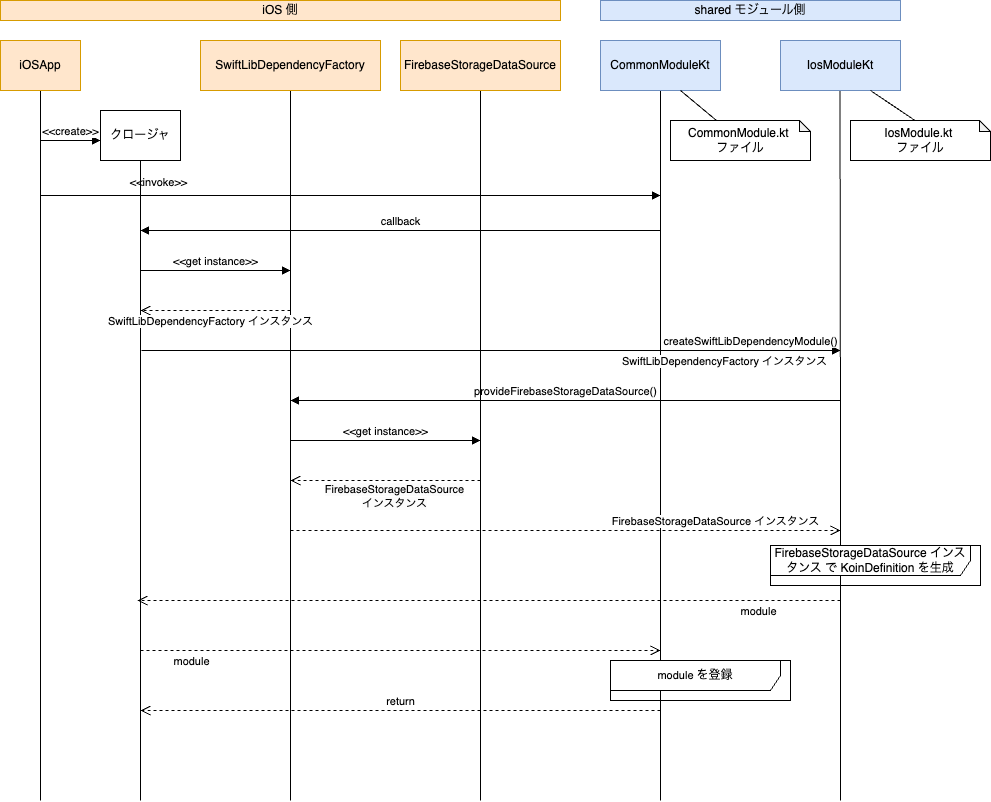
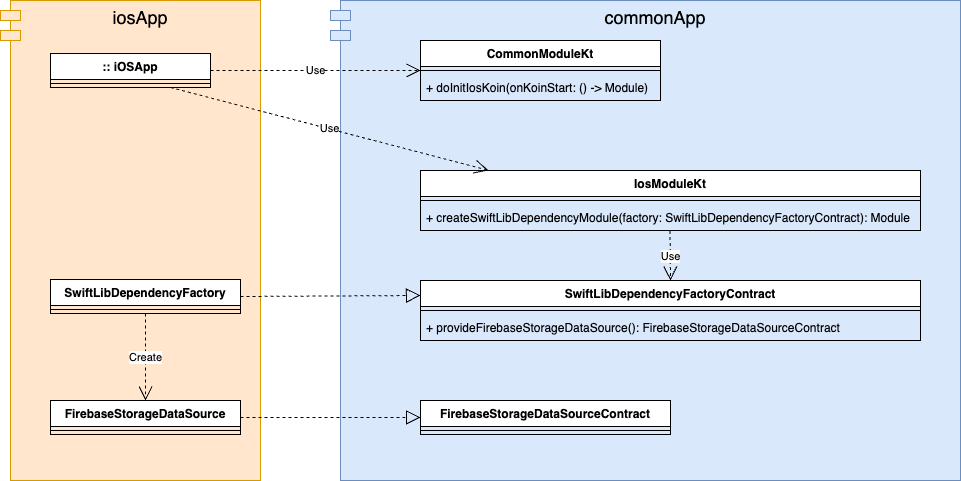
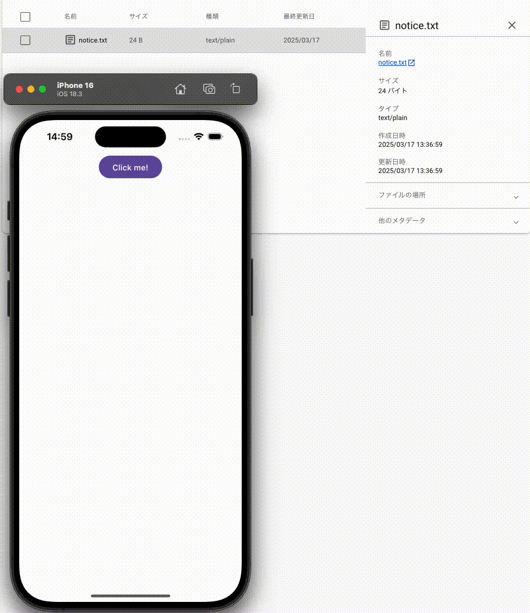

# Kmp Firebase Storage

### Technology Stack

* Framework
    * [Compose Multiplatform](https://www.jetbrains.com/ja-jp/compose-multiplatform/)
* DI
    * [Koin](https://insert-koin.io/)
    * [Koin Test](https://insert-koin.io/docs/reference/koin-test/testing/)   
* Firebase
    * [Android 用 Cloud Storage SDK](https://firebase.google.com/docs/storage/android/start?hl=ja)
    * [Swift Package Manager の Cloud Storage ライブラリ](https://firebase.google.com/docs/storage/ios/start?hl=ja)
    * [AppCheck](https://firebase.google.com/docs/app-check?hl=ja)

### Firebase プロジェクトにアプリを登録

1. **iOSアプリを登録**:
   - Firebaseコンソールで「プロジェクトの設定」を開き、アップルアプリを追加する。
   - GoogleService-Info.plist を Xcode プロジェクトに組み込む。

2. **Androidアプリを登録**:
   - Firebaseコンソールで「プロジェクトの設定」を開き、Android アプリを追加する。
   - google-services.json を Android プロジェクトに組み込む。

### Firebase AppCheck 設定手順

1. **iOSアプリの設定**:
   - 左のメニューの AppCheck -> 「API」タブを選択し、Storage に AppCheck を適用する。
   -「アプリ」タブ -> 上記アップルアプリ に移動し、証明書プロバイダ「DeviceCheck」を設定する。
   - Apple Developer Console で DeviceCheck 用の秘密鍵ファイルを生成し、認証キーとして設定する。
   - iOS アプリをシミュレーターまたは実機上で起動し、ログに出力されたデバッグトークンを設定する。

2. **Androidアプリの設定**:
   - 左のメニューの AppCheck -> 「アプリ」タブ -> 上記 Android アプリ に移動し、証明書プロバイダ「Play Integrity」を設定する。
   - 開発用(~/.android/debug.keystore)の SHA-256 証明書からフィンガープリントを生成して設定する。
   - Android アプリをシミュレーターまたは実機上で起動し、ログに出力されたデバッグトークンを設定する。

4. **注意点**:
   - デバッグトークンは開発環境でのみ使用してください
   - 本番環境ではデバッグトークンを使用しないでください
   - デバッグトークンの有効期限が切れる前に更新してください
   - デバッグトークンはセキュリティ上の理由から定期的に更新することを推奨します

### Firebase Storage 設定手順

- 「notice.txt」ファイルを追加
    ファイル内の文字列がアプリ上に表示さされる。
- 「ルール」には以下を設定する。
    ```
    rules_version = '2';
    service firebase.storage {
      match /b/{bucket}/o {
        match /{allPaths=**} {
          allow read
          allow write: if false; // 書き込みは禁止
        }
      }
    }
    ```

### 設計

#### Firebase Storage アクセス

シーケンス図  



クラス図  


### デモ

