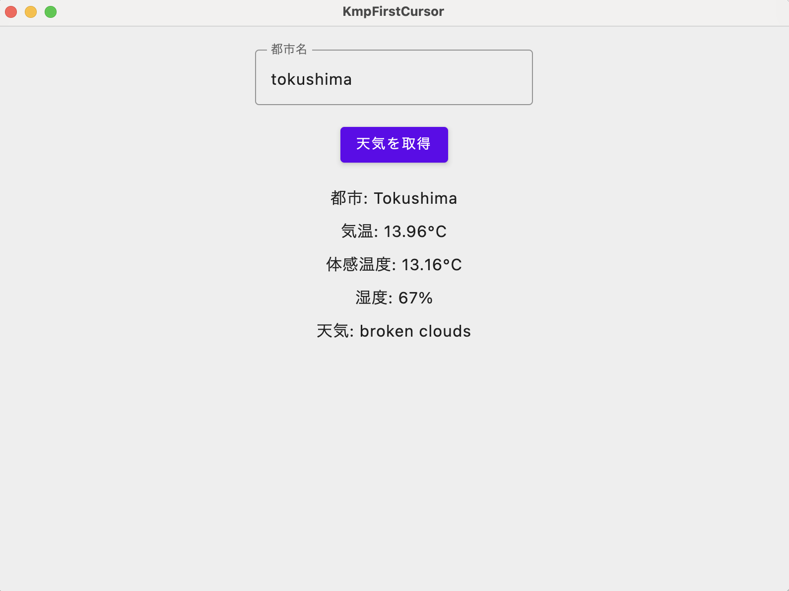
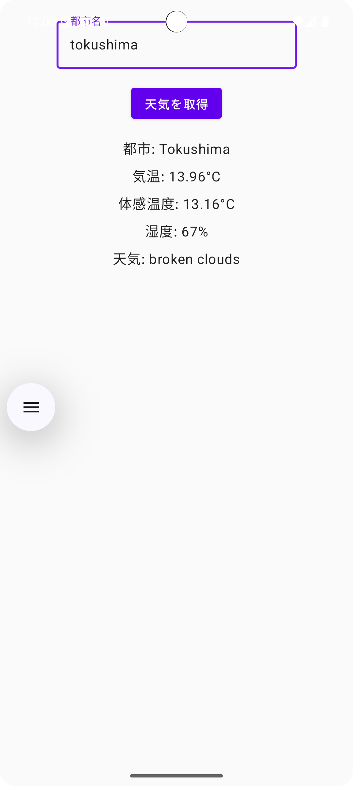
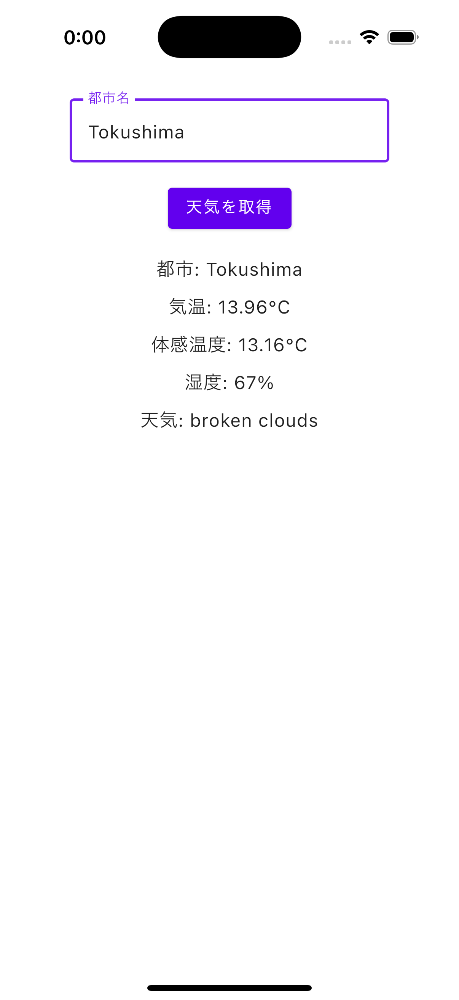

# KMP First Cursor

世界中の都市の天気情報を表示するアプリケーションです。

- Kotlin Multiplatform を採用しており、デスクトップ、Android、iOS をターゲットにビルドできます。
- 天気情報は OpenWeatherMap API を使って取得します。
- 本プロジェクトは AI コードエディター [Cursor](https://www.cursor.com/ja) でビルドできます。

## スクリーンショット

### デスクトップ版


### Android版


### iOS版


## 機能

- 都市名を入力して天気情報を取得
- 気温、体感温度、湿度、天気の説明を表示
- デスクトップ、Android、iOSで動作
- マルチプラットフォーム対応のUI（Compose Multiplatform）

## 必要条件

- Kotlin 2.1.10以上
- OpenWeatherMap APIキー
- Android Studio Meerkat | 2024.3.1以上（Android開発用）
- Xcode 15.0以上（iOS開発用）

## セットアップ

1. プロジェクトをクローン
```bash
git clone [https://github.com/seabat/kmp-samples.git]
cd KmpFirstCursor
```

2. OpenWeatherMap APIキーの設定
- [OpenWeatherMap](https://openweathermap.org/)でアカウントを作成し、APIキーを取得
- Android アプリ用に `local.properties`ファイルに以下の行を追加：
```properties
OPENWEATHERMAP_API_KEY=YOUR_API_KEY
```

- iOSアプリ用に`iosApp/Config.xcconfig`ファイルを編集し、APIキーを設定：
```
OPENWEATHERMAP_API_KEY=YOUR_API_KEY
```

- デスクトップアプリ用に`composeApp/src/desktopMain/kotlin/dev/seabat/kmp/firstcursor/PlatformConfigProvider.desktop.kt`ファイルを編集し、APIキーを設定：
```kotlin
actual fun getApiKey(): String {
    // 直接APIキーを返す
    return "YOUR_API_KEY"
}
```

3. 依存関係のインストール
```bash
./gradlew build
```


## Cursor 上でのビルド方法

### デスクトップ版
Shift+Command+D で「Run and Debug」を起動し、「Run Desktop App」を選択 & 実行

### Android版
Shift+Command+D で「Run and Debug」を起動し、「Create Android Debug APK」を選択 & 実行

### iOS版
Shift+Command+D で「Run and Debug」を起動し、「Compile iOS Shared Kotlin Metadata」を選択 & 実行


## 実行方法

### デスクトップ版
```bash
./gradlew composeApp:run
```

### Android版
Android Studio で `composableApp` モジュールを Run 実行

### iOS版
Xcodeで`iosApp`プロジェクトを開いて実行

## 技術スタック

- Kotlin Multiplatform
- Compose Multiplatform
- Ktor（HTTPクライアント）
- Kotlinx.Serialization（JSONシリアライズ）
- Gradle

## ライセンス

MIT License

This is a Kotlin Multiplatform project targeting Android, iOS, Desktop.
