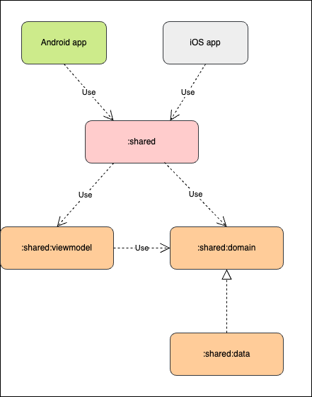

# KMP Multi Module

### Technology Stack

* フレームワーク
    * [Kotlin Multiplatform](https://kotlinlang.org/docs/multiplatform.html)
* DI
    * [Koin](https://insert-koin.io/)
* 通信ライブラリ
    * [Ktor Client](https://ktor.io/docs/client-dependencies.html#client-dependency)      

### 構成

ViewModel 層、ドメイン層、データ層をそれぞれ Android、iOS の両 OS から利用できるモジュールに分割する。  

  

ポイントは Android、iOS の両 OS から依存するモジュールは一つだけに Umbrella モジュールを作ること。Umbrella モジュールを作る必要性については [ここ](https://santimattius.github.io/kmp-for-mobile-native-developers-book/#179504e6-f752-8099-8fa7-e8df8e7c661f)を参照されたい。