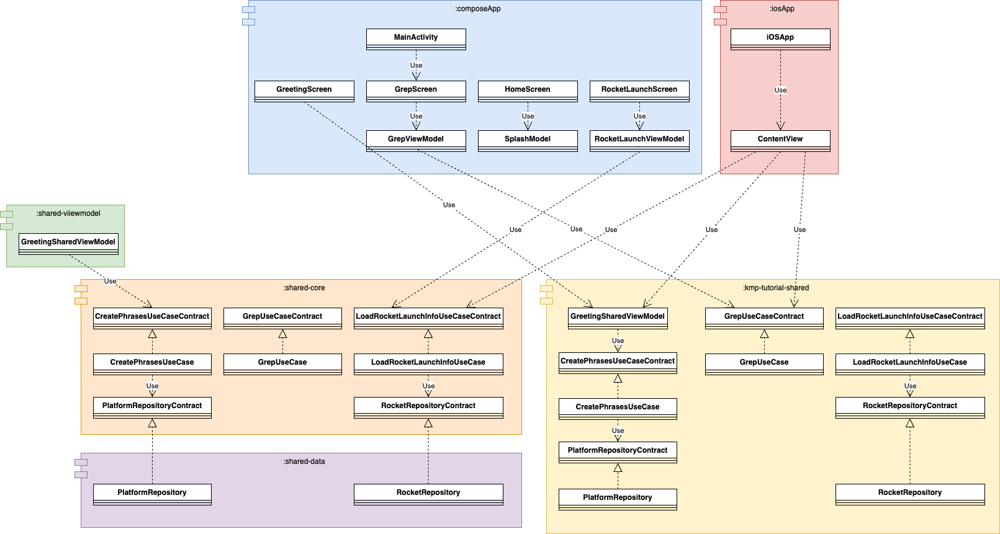

# KMP Multi Module With Submodule

KMP Multi Module Sample リポジトリ内に KMP Tutorial リポジトリを Git サブモジュールとして配置し、KMP Multi Module Sample の shared モジュールから KMP Tutorial の shared モジュールを参照する。

### Technology Stack

* フレームワーク
  * [Kotlin Multiplatform](https://kotlinlang.org/docs/multiplatform.html)
* DI
  * [Koin](https://insert-koin.io/)
* 通信ライブラリ
  * [Ktor Client](https://ktor.io/docs/client-dependencies.html#client-dependency)

### 構成

メインプロジェクトのリポジトリには Umbrella モジュール、ViewModel モジュール、ドメインモジュール、データモジュール、 Android 本体、iOS 本体を配置する。さらに GitSub サブモジュールとして [kmp-tutorial](https://github.com/seabat/kmp-tutorial)リポジトリを配置する。kmp-tutorial には shared モジュールが含まれている。

  
    

KMP におけるマルチモジュール構成は Umbrella モジュールが適用されているので、 Gitサブモジュール内にある shared モジュールは Umbrella モジュールから参照されることになる。   
  
Umbrella モジュールをについては [ここ](https://santimattius.github.io/kmp-for-mobile-native-developers-book/#179504e6-f752-8099-8fa7-e8df8e7c661f)を参照されたい。

##### クラス図

各 OS の UI 層からメインプロジェクトのモジュールとGitSub サブモジュール内のモジュールにアクセスする。

### スクリーンショット

#### Android

      

#### iOS

