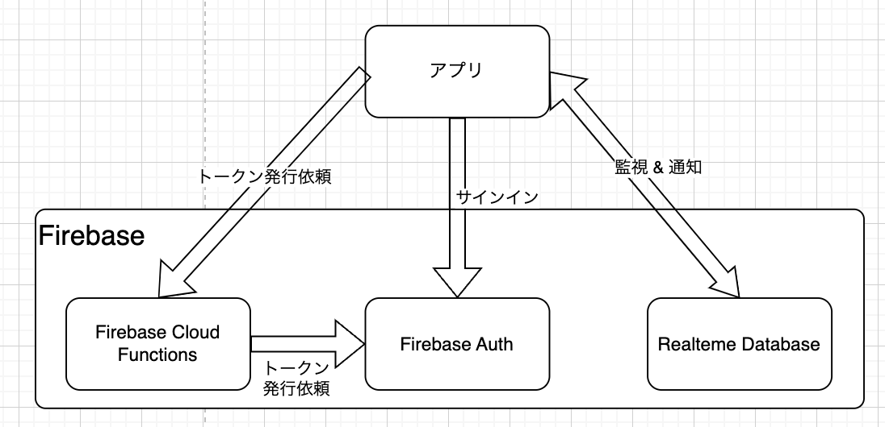
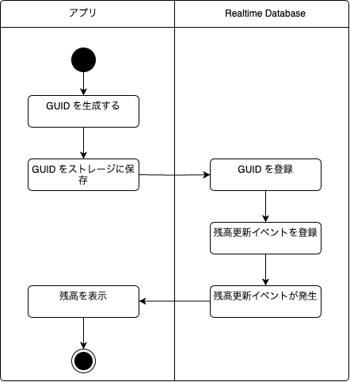
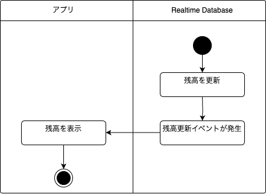
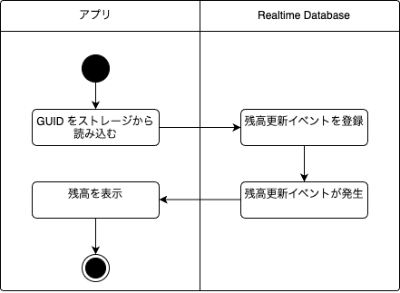

# Kmp Realtime Database Sample

### Technology Stack

* Framework
    * [Compose Multiplatform](https://www.jetbrains.com/ja-jp/compose-multiplatform/)
* ストレージアクセス
    * [DataStore](https://developer.android.com/kotlin/multiplatform/datastore?hl=ja)
* Firebase クライアント
    * [Firebase Kotlin SDK](https://github.com/GitLiveApp/firebase-kotlin-sdk) 

### 構成

  
  
* アプリ  
    Realtime Database を監視し Realtime Database が更新されると更新内容を表示する
* Firebasse Cloud Functions  
    Firebase に対して[カスタム認証](https://firebase.google.com/docs/auth/flutter/custom-auth?hl=ja)を実施、トークンを取得する。正規のシステムであればバックエンドがカスタム認証を実施するはずだが、本プロジェクトはサンプルなので、Firebasse Cloud Functions で代替している。
* Firebase Auth  
    [カスタム認証](https://firebase.google.com/docs/auth/flutter/custom-auth?hl=ja)で Realtime Database にアクスセスするためのトークンを発行する。
* [Realtime Database](https://firebase.google.com/docs/database?hl=ja)
       

### 仕様

アプリ初回起動時  
  

データ更新時  
  

アプリ再起動時  
  


#### Firebase Realtime Database アクセス実装 

``` kotlin
package dev.seabat.kmp.rtdb.repository

import dev.gitlive.firebase.Firebase
import dev.gitlive.firebase.database.DataSnapshot
import dev.gitlive.firebase.database.database
import kotlinx.coroutines.flow.Flow

class RealtimeDatabaseRepository {

    fun readUser(id: String): Flow<DataSnapshot> {
        val database = Firebase.database
        val ref = database.reference("users/$id")
        return ref.valueEvents
    }

    fun readBalance(id: String): Flow<DataSnapshot> {
        val database = Firebase.database
        val ref = database.reference("users/$id/balance")
        return ref.valueEvents
    }

    suspend fun writeUser(id: String, user: User) {
        val database = Firebase.database
        val ref = database.reference("users")
        val childRef = ref.child(id)
        childRef.setValue(user)
    }
}
```

### デモ

