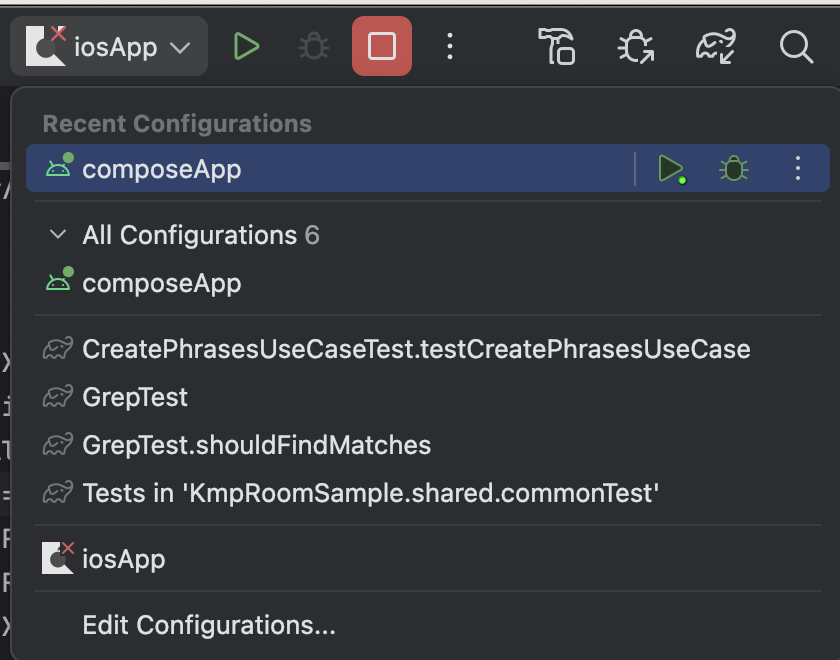
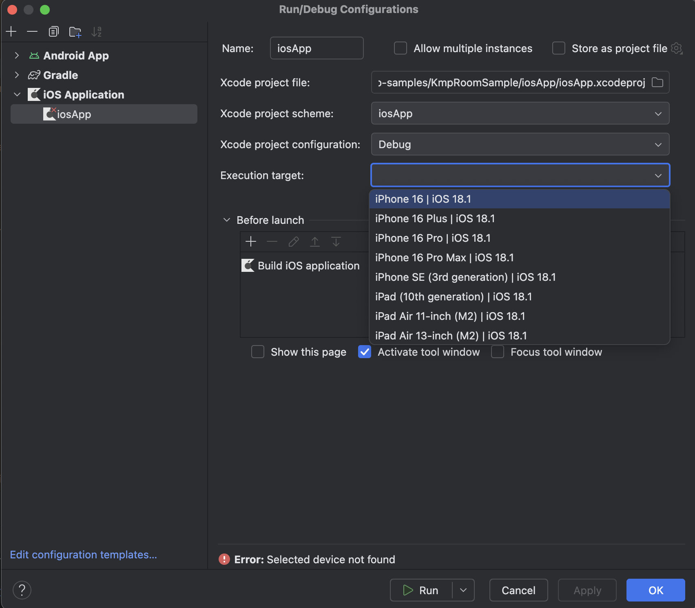

KMP Room Sample
==============

### プロジェクト作成手順

1. [KmpTutorial](https://github.com/seabat/kmp-tutorial/tree/main/KmpTutorial) プロジェクトをコピーする。  
2. ルートフォルダを KmpTutorial から KmpRoomSample に置き換える。
3. ディレクトリを dev/seabat/kmp/tutorial/ から dev/seabat/kmp/roomsample/ にリネーム。 
4. プロジェクト全体を "tutorial" で grep し、ヒットしたら "roomsample" に置き換える。
5. .idea/workspace.xml 内の "tutorial" を "roomsample" に置き換える。  
6. .idea/KmpTutorial.iml を .idea/KmpRoomSample.iml にリネーム。 
7. .idea/modules/composeApp/KmpTutorial.composeApp.iml を .idea/modules/composeApp/KmpRoomSample.composeApp.iml にリネーム。  
8. ビルドターゲット iosApp がエラーになっている場合は Run/Debug Configuratons を開き、 Excution Target を選択する。  
    