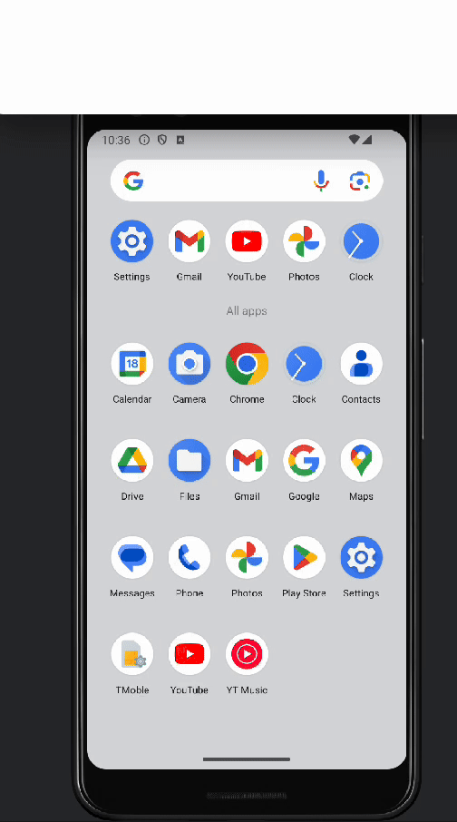

# kmp-samples

Kotlin MultiPlatform のサンプル集

## KmpRoomSample

TBD

## KmpRealtimeDatabaseSample

[Firebase Realtime Database](https://firebase.google.com/docs/database?hl=ja) を扱うサンプルプログラム。

#### 仕様

アプリ初回起動時  
  

データ更新時  
  

アプリ再起動時  
  


#### Firebase Realtime Database アクセス実装 

``` kotlin
package dev.seabat.kmp.rtdb.repository

import dev.gitlive.firebase.Firebase
import dev.gitlive.firebase.database.DataSnapshot
import dev.gitlive.firebase.database.database
import kotlinx.coroutines.flow.Flow

class RealtimeDatabaseRepository {

    fun readUser(id: String): Flow<DataSnapshot> {
        val database = Firebase.database
        val ref = database.reference("users/$id")
        return ref.valueEvents
    }

    fun readBalance(id: String): Flow<DataSnapshot> {
        val database = Firebase.database
        val ref = database.reference("users/$id/balance")
        return ref.valueEvents
    }

    suspend fun writeUser(id: String, user: User) {
        val database = Firebase.database
        val ref = database.reference("users")
        val childRef = ref.child(id)
        childRef.setValue(user)
    }
}
```

#### デモ


