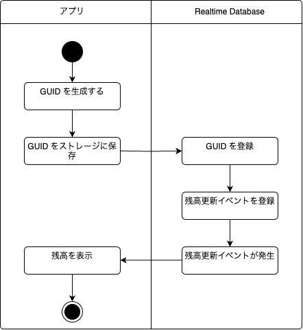

# kmp-samples

Kotlin MultiPlatform のサンプル集

## Kmp Room Sample

TBD


## Kmp Realtime Database Sample

[Firebase Realtime Database](https://firebase.google.com/docs/database?hl=ja) を扱うサンプルプログラム。

#### 構成

  
  

* UI は [Compose Multiplatform](https://www.jetbrains.com/ja-jp/compose-multiplatform/) を使用。
* Firebase Realtime Databa へのアクセスは [firebase-kotlin-sdk](https://github.com/GitLiveApp/firebase-kotlin-sdk/tree/master/firebase-database) を使用。

#### 仕様

アプリ初回起動時  
  

データ更新時  
  

アプリ再起動時  
  


#### Firebase Realtime Database アクセス実装 

``` kotlin
package dev.seabat.kmp.rtdb.repository

import dev.gitlive.firebase.Firebase
import dev.gitlive.firebase.database.DataSnapshot
import dev.gitlive.firebase.database.database
import kotlinx.coroutines.flow.Flow

class RealtimeDatabaseRepository {

    fun readUser(id: String): Flow<DataSnapshot> {
        val database = Firebase.database
        val ref = database.reference("users/$id")
        return ref.valueEvents
    }

    fun readBalance(id: String): Flow<DataSnapshot> {
        val database = Firebase.database
        val ref = database.reference("users/$id/balance")
        return ref.valueEvents
    }

    suspend fun writeUser(id: String, user: User) {
        val database = Firebase.database
        val ref = database.reference("users")
        val childRef = ref.child(id)
        childRef.setValue(user)
    }
}
```

#### デモ


## Kmp Multi Module Sample

Kotlin Multiplatform の shared モジュールをマルチモジュール化したい際に参考になるリポジトリ。

### 構成

ViewModel 層、ドメイン層、データ層をそれぞれ Android、iOS の両 OS から利用できるモジュールに分割する。


ポイントは Android、iOS の両 OS から依存するモジュールは一つだけに Umbrella モジュールを作ること。Umbrella モジュールを作る必要性については [ここ](https://santimattius.github.io/kmp-for-mobile-native-developers-book/#179504e6-f752-8099-8fa7-e8df8e7c661f)を参照されたい。
