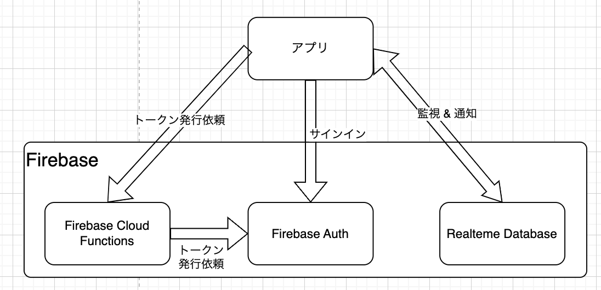

# kmp-samples

Kotlin MultiPlatform のサンプル集

## Kmp Room Sample

TBD


## Kmp Realtime Database Sample

[Firebase Realtime Database](https://firebase.google.com/docs/database?hl=ja) を扱うサンプルプログラム。

### 構成

#### システム構成  

  

* バックエンドとして、Realtime Database、 Firebase Cloud Functions、 Firebase Auth を使用。

#### アプリ構成  

  
  

* UI は [Compose Multiplatform](https://www.jetbrains.com/ja-jp/compose-multiplatform/) を使用。
* Firebase Realtime Databa へのアクセスは [firebase-kotlin-sdk](https://github.com/GitLiveApp/firebase-kotlin-sdk/tree/master/firebase-database) を使用。

### 仕様

#### Realtime Database 監視開始  

  

#### Realtime Database 更新通知  

  

#### Realtime Database データ構造  

users/ユーザーID(アカウントID)/GUID/balance
  

#### Realtime Database ルール  

Firebase Auth を使い、アカウントID(ユーザーID)に対する Firebase トークン発行する。 users/アカウントID(ユーザーID) とトークンに含まれるアカウントID(ユーザーID)が一致すればアクセス権限が与えられる。

``` 
{
  "rules": {
    "users": {
      "$accountId": {
        ".read": "$accountId === auth.uid",
        ".write": "$accountId === auth.uid"
      }
    }
  }
}
```

※ アプリからデータを書き込むことはないので `".write": false` にしておいて良い。

### デモ


## Kmp Multi Module Sample

Kotlin Multiplatform の shared モジュールをマルチモジュール化したい際に参考になるリポジトリ。

### 構成

ViewModel 層、ドメイン層、データ層をそれぞれ Android、iOS の両 OS から利用できるモジュールに分割する。


ポイントは Android、iOS の両 OS から依存するモジュールは一つだけに Umbrella モジュールを作ること。Umbrella モジュールを作る必要性については [ここ](https://santimattius.github.io/kmp-for-mobile-native-developers-book/#179504e6-f752-8099-8fa7-e8df8e7c661f)を参照されたい。
